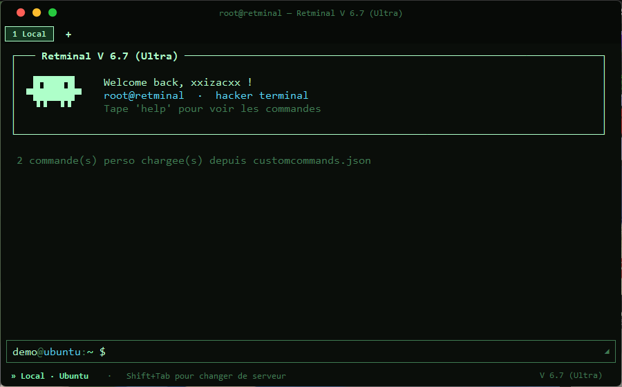
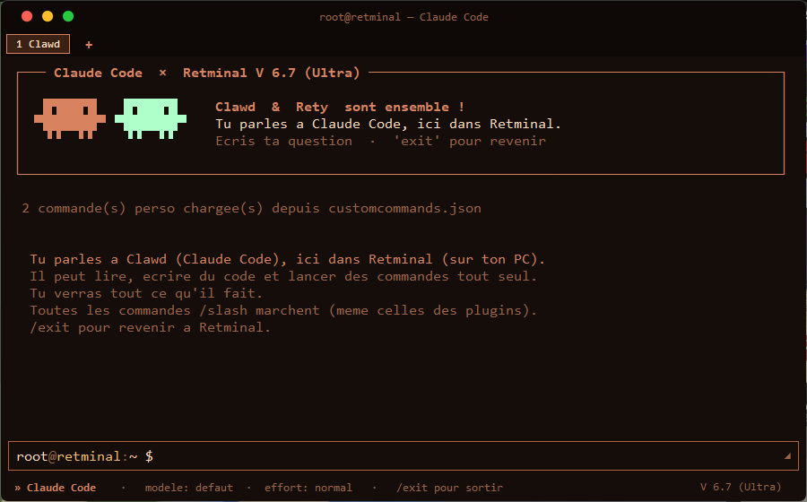

<h1 align="center">🟢 Retminal</h1>

<p align="center">
  Un terminal <b>« hacker »</b> en Python/Tkinter — avec <b>Claude Code intégré</b>,
  connexion SSH/VPS, éditeur, moniteur système et plein d'outils. Compilable en <code>.exe</code> et <code>.app</code>.
</p>

<p align="center">
  
  
  
  
</p>



---

## 🎯 C'est quoi ?

**Retminal** est un terminal au style « hacker » (fond noir, texte vert qui brille) écrit en
**Python + Tkinter**, dans **un seul fichier**. Par défaut il parle à **Ubuntu (WSL)** sur ton PC,
donc tu tapes de **vraies commandes Linux** (`ls`, `cat`, `apt`, `python3`, `git`…). Il se connecte
aussi en **SSH à ton serveur VPS**, et il embarque **Claude Code directement à l'intérieur**.

> Bricolé avec amour par **xxizacxx** & **Clawd** 🐾

---

## ✨ Fonctionnalités

- 🐧 **Shells locaux** — Ubuntu (WSL) par défaut, + `cmd.exe` et `PowerShell` (`Ctrl+ù` pour changer)
- 🔌 **SSH / VPS** — `connect`, la connexion reste vivante en arrière-plan (reconnexion instantanée)
- 🤖 **Claude Code intégré** — la commande `claude` fait discuter Claude **dans** Retminal (voir plus bas)
- 🗂️ **Onglets** — plusieurs terminaux, une commande peut tourner par onglet en arrière-plan
- ⏳ **File d'attente** — tape plusieurs commandes d'affilée, elles s'enchaînent toutes seules
- 📓 **Carnet** — un éditeur de fichiers plein écran (thème bleu nuit, façon papier)
- 📊 **`sysinfo` / `moniteur`** — gestionnaire des tâches plein écran (CPU/RAM/disque en direct) pour le PC ou le VPS
- 📁 **Explorateur VPS** — parcours les fichiers de ton serveur en plein écran
- ⚙️ **Page `config`** — règle tout (serveurs, alias, clés SSH, thème, shells, dépendances…) sans toucher aux fichiers
- 💬 **Gestionnaire de conversations** — reprends une vieille discussion avec Claude
- 🎨 **Markdown + couleurs `§`** — le `**gras**`, `*italique*`, `` `code` `` et les couleurs à la Minecraft s'affichent en vrai
- 📂 **Aide à la saisie des chemins** — complétion 📁/📄 de fichiers/dossiers
- 🎨 **3 thèmes** — vert (hacker), bleu, orange (Claude)

---

## 🤖 Claude Code, dans le terminal

Tape `claude` : tout devient **orange**, et tu discutes avec Claude Code **sans quitter Retminal**.
Tu vois **tout** ce qu'il fait (le code qu'il écrit, les commandes qu'il lance), en direct.



---

## 🚀 Installation

Il te faut **Python 3.10+** (coche « Add Python to PATH » à l'installation sur Windows).

```bash
# 1. Récupère le projet
git clone https://github.com/xxizacxx/Retminal.git
cd Retminal

# 2. Installe les dépendances
pip install paramiko pillow cryptography

# 3. Crée tes secrets : copie le modèle et mets TES infos
#    (sur Mac le fichier s'appelle "secret.env")
cp .env.example .env

# 4. Lance !
python retminal.py
```

Tape **`help`** pour voir toutes les commandes. 🎉

> 📖 Guide complet (Claude Code, token, dépendances, compilation) : **[SETUP.md](SETUP.md)**
> 🔒 Ton `.env` (mots de passe, token) n'est **jamais** partagé — il est dans le `.gitignore`.

---

## ⌨️ Quelques commandes

| Commande | Ce que ça fait |
|----------|----------------|
| `help` | affiche l'aide |
| `claude` | discute avec Claude Code, dans Retminal |
| `connect` | se connecte en SSH au VPS |
| `config` | page de configuration plein écran |
| `sysinfo` | gestionnaire des tâches en direct |
| `nano <fichier>` | ouvre le carnet (éditeur) |
| `convos` | gestionnaire de conversations Claude |
| `ping <site>` | ping joli (latence en barres de couleur) |
| `say §a**Coucou**` | affiche du texte en couleur + gras |

*(et plein d'autres — tape `help` ou lis [LISEZ-MOI.txt](LISEZ-MOI.txt))*

---

## 🏗️ Fabriquer l'appli

- **Windows** (`.exe`) : double-clique `build.bat` → le fichier apparaît dans `dist/`
- **macOS** (`.dmg`) : le dossier [`Version-Mac/`](Version-Mac/) contient tout — lance `build_mac.command` **sur un Mac**

---

## 📜 Licence

[MIT](LICENSE) — fais-en ce que tu veux, garde juste le nom de l'auteur. © 2026 xxizacxx.

---

<p align="center"><i>Bricolé avec amour par xxizacxx & Clawd 🐾</i></p>
